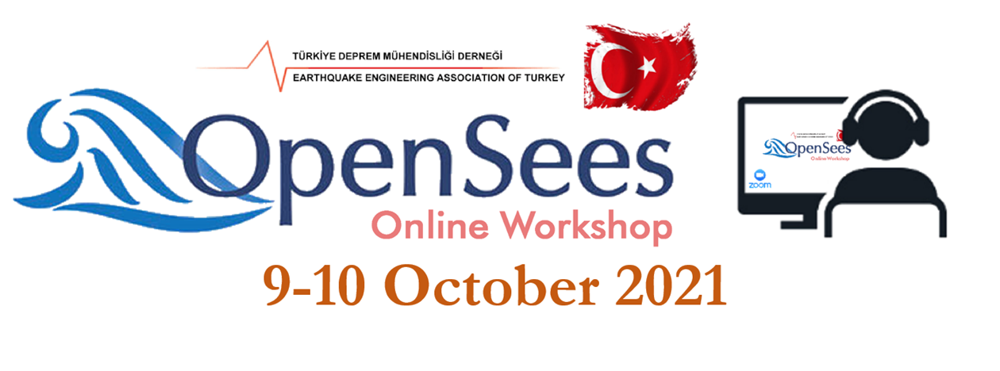
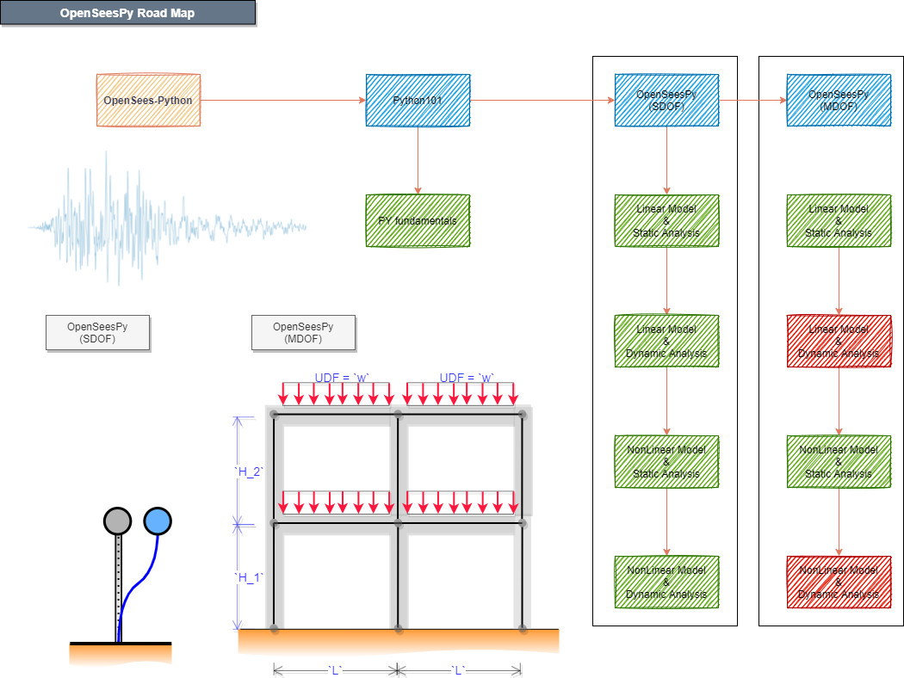

# OSW-6ICEES
This is the official repository for the course module presented on October 10th **OpenSees Workshop - 6th International Conference on Earthquake Engineering and Seismology (6ICEES)**. The outline of the course module is provided below. The participants are recommended to execute python code lines through jupyter notebook together with the instructors to make their learning more efficient. In order to reduce the amount of time to set up python enviroments, the participants are recommended to open notebooks with binder, in a readily available executable environment, by clicking the buttons provided below. 

## 1. Introduction

The chapter describes the motivation for the course module. The participants are informed about the advantages of using *Python* over *Tcl* as an OpenSees interpreter. Installation and use of *Python* in different platforms (cloud or PC) is explained.

## 2. Python for Beginners

The chapter introduces main characteristics of the Python language (e.g. syntax, data types, operators, control flow and loops, functions, libraries). The most commonly used libraries for scientific purposes are introduced. Finally, for a given site in Turkey, the ground motion record selection is carried out in accordance with Turkish Building Code 2018 (TBDY 2018) using a readily available python package. 

## 3. SDOF Systems

The numerical modelling and structural analysis of different single degree of freedom (SDOF) systems using OpenSeesPy is demonstrated. Three of the available uniaxial materials in OpenSeesPy are tested using cyclic and monotonic loading. Single and sequential dynamic analyses are carried out using the selected ground motion records.

## 4. 2D Frame Systems

The numerical modelling and structural analysis of 2D reinforced concrete frame system using OpenSeesPy is demonstrated. In particular, two different models of the same frame are considered: elastic and inelastic. Moreover, different analyses are carried out: linear and nonlinear static analysis, response spectrum analysis, and nonlinear response history analysis.

## 5. Hackathon

In this chapter the participants are being asked to demonstrate what they learned by solving a simple exercise using OpenSeesPy. The instructors will help the participants throughout the session if they encounter any issue or problem.

